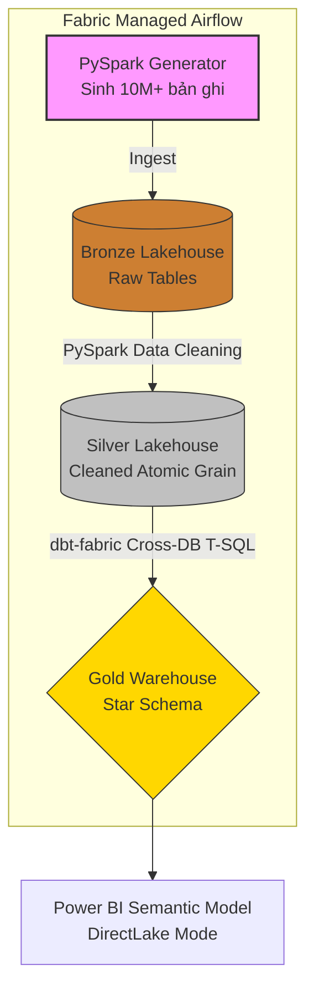

<div align="center">
  <h1>🚛 Microsoft Fabric x dbt: Hệ thống Data Lakehouse Phân tích Lợi nhuận Logistics</h1>
  <p>Dự án Xây dựng Data Lakehouse trên nền tảng <b>Microsoft Fabric</b> và <b>dbt-fabric</b> nhằm giải quyết bài toán "Ảo giác Doanh thu" trong mạng lưới Logistics quy mô lớn.</p>
</div>

---

## 📖 Bối cảnh Dự án & Mục tiêu Kinh doanh

Trong một mạng lưới vận chuyển rộng lớn trải dài qua nhiều tỉnh thành, ban lãnh đạo thường gặp phải vấn đề **"Ảo giác Doanh thu"**. Một dịch vụ chuyển phát (ví dụ: Chuyển phát tiêu chuẩn) có thể đem lại doanh thu gộp hàng tỷ đồng, nhưng sau khi trừ đi chi phí vận hành (Cước vận chuyển liên tỉnh, Thù lao công phát tại bưu cục đích), biên lợi nhuận thực tế lại là con số âm.

Dự án này xây dựng một **Ma trận Phân tích Lợi nhuận (Service-Location Profitability Matrix)** từ cấp độ Dữ liệu thô (Raw) lên tới Tầng Báo cáo (Gold), tập trung vào các kết quả phân tích đầu ra chiến lược:

1.  **Phát hiện Điểm "Chảy máu" Lợi nhuận (Profit Leakage):** Nhận diện chính xác các Tuyến đường và Dịch vụ đang phải "lấy lãi bù lỗ".
2.  **Đánh giá Hiệu quả Bưu cục (Network Optimization):** Phân tích lượng đơn hàng và thù lao công phát để tìm ra các bưu cục (POS) hoạt động kém hiệu quả.
3.  **Tối ưu Ngân sách Marketing:** Hỗ trợ ra quyết định nên tập trung đẩy mạnh dịch vụ nào, ở tệp khách hàng nào để tối đa hóa dòng tiền thực tế.

---

## 🏗️ Kiến trúc Hệ thống & Luồng Dữ liệu (Fabric Native: Lakehouse + Warehouse)

Dự án tuân thủ nghiêm ngặt **Kiến trúc Medallion (Bronze ➔ Silver ➔ Gold)** kết hợp giữa tính linh hoạt của Data Lake và sức mạnh quan hệ của Data Warehouse:
*   **Bronze & Silver Layer**: Lưu trữ trên **Fabric Lakehouse (Delta Parquet)**, xử lý biến đổi dữ liệu lớn bằng **PySpark**.
*   **Gold Layer**: Lưu trữ trên **Fabric Data Warehouse (`wh_gold`)**, mô hình hóa Star Schema bằng **dbt-fabric (T-SQL)** với đầy đủ khả năng tạo bảng vật lý (`CREATE TABLE`) và **Incremental Load (Upsert)**.
*   **Orchestration**: Toàn bộ pipeline được điều phối tự động thông qua **Fabric Managed Apache Airflow**.



### Chi tiết Mô hình Dữ liệu (Bus Matrix)
*   **Tầng Bronze (Raw Lakehouse):** Dữ liệu thô được sinh bởi Spark Job (`bronze_customers`, `bronze_services`, `bronze_pos_locations`, `bronze_revenue`, `bronze_delivery`).
*   **Tầng Silver (Cleaned Lakehouse):** 
    *   Làm sạch bằng PySpark ở mức Atomic Grain (Chi tiết từng giao dịch).
    *   Sửa lỗi kiểu dữ liệu (casting), trim khoảng trắng, loại bỏ trùng lặp (dedup).
*   **Tầng Gold (Analytics Ready Star Schema trong Warehouse):** 
    *   Transform từ Silver sang Gold bằng **dbt-fabric** (qua T-SQL endpoint của Fabric Warehouse).
    *   **4 Bảng Chiều (Dimensions):** Khách hàng (`dim_customer`), Dịch vụ (`dim_service`), Bưu cục (`dim_pos_location`), Thời gian (`dim_date`).
    *   **2 Bảng Sự kiện (Fact):** Doanh thu thu vào (`fact_revenue`) và Thù lao công phát chi ra (`fact_delivery_remuneration`).
    *   Sẵn sàng cho **Power BI DirectLake**.

---

## 🚀 Hướng dẫn Cài đặt & Thực thi Chi tiết

### 1. Điều kiện Tiên quyết (Prerequisites trên Local)
Trước khi chạy dbt từ máy local, hãy đảm bảo máy tính của bạn đã đáp ứng các điều kiện sau:
*   **Python:** Phiên bản `3.10+` (khuyến nghị từ 3.10 đến 3.12).
*   **ODBC Driver 18 for SQL Server (Bắt buộc trên Windows):** 
    `dbt-fabric` giao tiếp với Fabric SQL Analytics Endpoint thông qua giao thức TDS (Tabular Data Stream). Tải và cài đặt bản chính thức: [Microsoft ODBC Driver 18 for SQL Server (x64)](https://learn.microsoft.com/en-us/sql/connect/odbc/download-odbc-driver-for-sql-server).
*   **Azure Service Principal (Entra ID):** 
    Tài khoản Service Principal đã được cấp quyền Contributor/Admin trên Workspace Fabric hoặc quyền Read/Write trên Lakehouse.

---

### 2. Cấu hình Biến Môi trường (`.env`)
Copy file mẫu `.env.example` thành `.env` tại thư mục gốc của project:
```powershell
cp .env.example .env
```
Mở file `.env` và điền đầy đủ các thông số thực tế từ Fabric:
```env
# 1. Thông tin SQL Connection String của Fabric Warehouse
# (Lấy tại: Fabric Warehouse 'wh_gold' > Settings > SQL connection string)
FABRIC_SERVER=your-workspace-guid.datawarehouse.fabric.microsoft.com

# Target Fabric Warehouse cho tầng Gold (dbt ghi vào đây)
FABRIC_DATABASE=wh_gold
FABRIC_SCHEMA=dbo

# Source Lakehouse cho tầng Silver (dbt đọc dữ liệu từ đây qua cross-database query)
FABRIC_SILVER_DATABASE=lh_silver
FABRIC_SILVER_SCHEMA=dbo

# 2. Thông tin xác thực Azure Service Principal (Entra ID)
FABRIC_TENANT_ID=xxxxxxxx-xxxx-xxxx-xxxx-xxxxxxxxxxxx
FABRIC_CLIENT_ID=xxxxxxxx-xxxx-xxxx-xxxx-xxxxxxxxxxxx
FABRIC_CLIENT_SECRET=your_service_principal_client_secret

# 3. Thông tin cho Airflow Orchestration (nếu dùng Airflow)
FABRIC_WORKSPACE_ID=your_workspace_id
FABRIC_BRONZE_SPARK_JOB_ID=your_bronze_job_id
FABRIC_SILVER_SPARK_JOB_ID=your_silver_job_id
```

> [!NOTE]
> `dbt-core` và VS Code Terminal tự động đọc trực tiếp file `.env` tại thư mục gốc và truyền vào các hàm `{{ env_var('...') }}` trong `profiles.yml` mà không cần bất kỳ công cụ nạp môi trường trung gian nào.

---

### 3. Thiết lập Môi trường Ảo & Cài đặt Thư viện

Mở terminal (PowerShell) tại thư mục gốc của dự án:

```powershell
# 1. Tạo môi trường ảo Python
python -m venv .venv

# 2. Kích hoạt môi trường ảo (trên Windows PowerShell)
.venv\Scripts\Activate.ps1

# 3. Nâng cấp pip
python -m pip install --upgrade pip

# 4. Cài đặt các gói cần thiết để chạy dbt ở local
pip install dbt-fabric==1.9.9
```

> [!TIP]
> Bạn **không cần** cài `apache-airflow-providers-microsoft-fabric` ở máy local (gói này dành riêng cho server/container chạy Airflow trên Linux/Docker).

---

### 4. Thực thi dbt từ Local kết nối tới Fabric

Mọi câu lệnh dbt đều được thực thi tại **thư mục gốc của project** (nơi chứa file `.env`):

#### Bước 4.1: Kiểm tra kết nối (`dbt debug`)
Kiểm tra cấu hình `profiles.yml`, kết nối mạng và xác thực với Fabric SQL Endpoint:
```powershell
dbt debug --project-dir dbt_project --profiles-dir dbt_project
```
Khi kết quả trả về `All checks passed!` và `Connection test: OK`, kết nối đã hoàn toàn thông suốt.

#### Bước 4.2: Tải các gói dbt phụ thuộc (Dependencies)
Nếu dự án có khai báo `packages.yml`:
```powershell
dbt deps --project-dir dbt_project --profiles-dir dbt_project
```

#### Bước 4.3: Thực thi biến đổi dữ liệu (Full-load vs Incremental Load)

Dự án được thiết kế theo kiến trúc tối ưu:
* **Các bảng Dimension (`dim_*`)**: Luôn chạy **Full-load** (ghi đè sạch sẽ toàn bộ danh mục).
* **Các bảng Fact (`fact_*`)**: Mặc định chạy **Incremental Load** (Upsert theo `unique_key='shipment_id'` kèm cửa sổ quét lùi 2 ngày phòng dữ liệu cập nhật trễ).

##### Lựa chọn 1: Chạy Incremental Load (Chạy định kỳ hàng ngày - Khuyên dùng)
Chỉ quét dữ liệu mới từ tầng Silver và Upsert vào Gold, tối ưu chi phí và thời gian chạy:
```powershell
# Chạy và test toàn bộ models:
dbt build --project-dir dbt_project --profiles-dir dbt_project

# Hoặc chỉ chạy riêng các bảng Fact:
dbt run --select fact_revenue fact_delivery_remuneration --project-dir dbt_project --profiles-dir dbt_project
```

##### Lựa chọn 2: Chạy Full-load lại toàn bộ từ đầu (`--full-refresh`)
Dùng khi bạn muốn **xóa và dựng lại 100% dữ liệu tầng Gold từ đầu** (ví dụ: ngày đầu triển khai hệ thống, vừa thay đổi cấu trúc cột hoặc muốn tính toán lại toàn bộ dữ liệu lịch sử):
```powershell
# Xóa và nạp lại toàn bộ (cả Dim và Fact):
dbt run --full-refresh --project-dir dbt_project --profiles-dir dbt_project

# Hoặc kết hợp vừa Full-load vừa chạy Tests kiểm tra:
dbt build --full-refresh --project-dir dbt_project --profiles-dir dbt_project
```

##### Lựa chọn 3: Chạy riêng từng Dimension
```powershell
dbt run --select dim_customer dim_service dim_pos_location dim_date --project-dir dbt_project --profiles-dir dbt_project
```

#### Bước 4.4: Kiểm tra chất lượng dữ liệu (`dbt test`)
Chạy các kiểm thử Schema Tests (not null, unique, foreign key relationship) đã định nghĩa trong file `schema.yml`:
```powershell
dbt test --project-dir dbt_project --profiles-dir dbt_project
```

#### Bước 4.5: Xem tài liệu mô hình hóa (dbt Docs)
```powershell
dbt docs generate --project-dir dbt_project --profiles-dir dbt_project
dbt docs serve --project-dir dbt_project --profiles-dir dbt_project
```

---

### 5. Khám phá bằng Fabric Notebooks & Điều phối Production

*   **Khám phá bằng Notebooks:** 
    Nếu muốn chạy thử nghiệm trực tiếp trên Fabric UI mà không qua local CLI, import các file `.ipynb` trong thư mục [notebooks/](file:///c:/Users/buith/OneDrive/Desktop/fabric_dbt_logistics_lakehouse/notebooks):
    - `01_generate_raw_data.ipynb`: Sinh dữ liệu thô vào tầng Bronze (phân vùng Year-Month).
    - `02_bronze_to_silver.ipynb`: Xử lý làm sạch và chuẩn hóa vào tầng Silver.
    - `03_run_dbt_gold.ipynb`: Thử nghiệm kích hoạt dbt từ notebook.
    - `04_parse_dbt_run_results.ipynb`: Đọc `run_results.json` để ghi audit log vào Delta Table.
*   **Vận hành tự động qua Airflow:** 
    - Đẩy code từ `spark_jobs/` lên Fabric tạo thành các **Spark Job Definitions**.
    - Sử dụng DAG [airflow/dags/dag_fabric_logistics_pipeline.py](file:///c:/Users/buith/OneDrive/Desktop/fabric_dbt_logistics_lakehouse/airflow/dags/dag_fabric_logistics_pipeline.py) trên **Fabric Managed Airflow** để điều phối trọn vẹn luồng dữ liệu tự động hàng ngày: `Bronze (Spark) ➔ Silver (Spark) ➔ Gold (dbt)`.
---

## ⚡ Điểm nhấn Kỹ thuật (Data Engineering Highlights)
*   **DirectLake Integration:** Kiến trúc Star Schema tại tầng Gold được thiết kế tối ưu 100% để tương thích với Power BI DirectLake Mode, giúp truy vấn dữ liệu tức thì mà không cần phải Import.
*   **dbt-fabric:** Áp dụng dbt để quản lý logic mô hình hóa bằng T-SQL trực tiếp trên nền tảng Serverless SQL của Fabric.
*   **Fully Native on Fabric:** Tích hợp sâu vào hệ sinh thái của Microsoft với Lakehouse, Spark Jobs, và Apache Airflow Managed by Data Factory.
