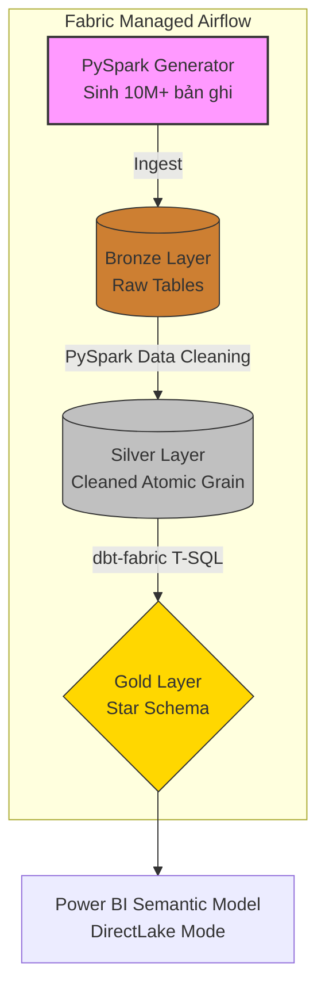

<div align="center">
  <h1>🚛 Microsoft Fabric x dbt: Hệ thống Data Lakehouse Phân tích Lợi nhuận Logistics</h1>
  <p>Dự án Xây dựng Data Lakehouse trên nền tảng <b>Microsoft Fabric</b> và <b>dbt-fabric</b> nhằm giải quyết bài toán "Ảo giác Doanh thu" trong mạng lưới Logistics quy mô lớn.</p>
</div>

---

## 📖 Bối cảnh Dự án & Mục tiêu Kinh doanh

Trong một mạng lưới vận chuyển rộng lớn trải dài qua nhiều tỉnh thành, ban lãnh đạo thường gặp phải vấn đề **"Ảo giác Doanh thu"**. Một dịch vụ chuyển phát (ví dụ: Chuyển phát tiêu chuẩn) có thể đem lại doanh thu gộp hàng tỷ đồng, nhưng sau khi trừ đi chi phí vận hành (Cước vận chuyển liên tỉnh, Thù lao công phát tại bưu cục đích), biên lợi nhuận thực tế lại là con số âm.

Dự án này xây dựng một **Ma trận Phân tích Lợi nhuận (Service-Location Profitability Matrix)** từ cấp độ Dữ liệu thô (Raw) lên tới Tầng Báo cáo (Gold), tập trung vào các kết quả phân tích đầu ra chiến lược:

1.  **Phát hiện Điểm "Chảy máu" Lợi nhuận (Profit Leakage):** Nhận diện chính xác các Tuyến đường và Dịch vụ đang phải "lấy lãi bù lỗ".
2.  **Đánh giá Hiệu quả Bưu cục (Network Optimization):** Phân tích lượng đơn hàng và thù lao công phát để tìm ra các bưu cục (POS) hoạt động kém hiệu quả.
3.  **Tối ưu Ngân sách Marketing:** Hỗ trợ ra quyết định nên tập trung đẩy mạnh dịch vụ nào, ở tệp khách hàng nào để tối đa hóa dòng tiền thực tế.

---

## 🏗️ Kiến trúc Hệ thống & Luồng Dữ liệu (Fabric Native)

Dự án tuân thủ nghiêm ngặt **Kiến trúc Medallion (Bronze ➔ Silver ➔ Gold)**. Toàn bộ dữ liệu được lưu trữ tập trung trên **Fabric Lakehouse (Delta Parquet)** trong OneLake. Quá trình ETL/ELT được điều phối tự động thông qua **Fabric Managed Apache Airflow**.



### Chi tiết Mô hình Dữ liệu (Bus Matrix)
*   **Tầng Bronze (Raw):** Dữ liệu thô được sinh bởi Spark Job (`bronze_customers`, `bronze_services`, `bronze_pos_locations`, `bronze_revenue`, `bronze_delivery`).
*   **Tầng Silver (Cleaned):** 
    *   Làm sạch bằng PySpark ở mức Atomic Grain (Chi tiết từng giao dịch).
    *   Sửa lỗi kiểu dữ liệu (casting), trim khoảng trắng, loại bỏ trùng lặp (dedup).
*   **Tầng Gold (Analytics Ready - Star Schema):** 
    *   Transform từ Silver sang Gold bằng **dbt-fabric** (qua T-SQL endpoint của Lakehouse).
    *   **4 Bảng Chiều (Dimensions):** Khách hàng (`dim_customer`), Dịch vụ (`dim_service`), Bưu cục (`dim_pos_location`), Thời gian (`dim_date`).
    *   **2 Bảng Sự kiện (Fact):** Doanh thu thu vào (`fact_revenue`) và Thù lao công phát chi ra (`fact_delivery_remuneration`).
    *   Sẵn sàng cho **Power BI DirectLake**.

---

## 🚀 Hướng dẫn Cài đặt & Vận hành

### 1. Chuẩn bị môi trường
1. Tạo một **Workspace** trên Microsoft Fabric.
2. Tạo một **Lakehouse** trong Workspace (ví dụ: `logistics_lakehouse`).
3. Cài đặt các thư viện Python cần thiết tại máy local:
   ```bash
   pip install -r requirements.txt
   ```
4. Copy file `.env.example` thành `.env` và điền các thông tin kết nối Fabric SQL Analytics Endpoint.

### 2. Chạy thử nghiệm bằng Notebooks
Bạn có thể import các file `.ipynb` trong thư mục `notebooks/` vào Fabric UI để chạy thử từng bước:
- `01_generate_raw_data.ipynb`: Sinh dữ liệu vào Bronze.
- `02_bronze_to_silver.ipynb`: Làm sạch từ Bronze sang Silver.
- `03_run_dbt_gold.ipynb`: Kích hoạt dbt chạy build Star Schema.
- `04_parse_dbt_run_results.ipynb`: Lưu log hệ thống dbt.

### 3. Cấu hình Airflow DAG
1. Đẩy các file `.py` trong `spark_jobs/` lên Fabric tạo thành **Spark Job Definitions**.
2. Copy `airflow/dags/dag_fabric_logistics_pipeline.py` vào thư mục DAGs của **Fabric Managed Airflow**.
3. Cập nhật các ID Workspace và Spark Job ID trong `.env` hoặc trực tiếp vào file DAG.

---

## ⚡ Điểm nhấn Kỹ thuật (Data Engineering Highlights)
*   **DirectLake Integration:** Kiến trúc Star Schema tại tầng Gold được thiết kế tối ưu 100% để tương thích với Power BI DirectLake Mode, giúp truy vấn dữ liệu tức thì mà không cần phải Import.
*   **dbt-fabric:** Áp dụng dbt để quản lý logic mô hình hóa bằng T-SQL trực tiếp trên nền tảng Serverless SQL của Fabric.
*   **Fully Native on Fabric:** Tích hợp sâu vào hệ sinh thái của Microsoft với Lakehouse, Spark Jobs, và Apache Airflow Managed by Data Factory.
